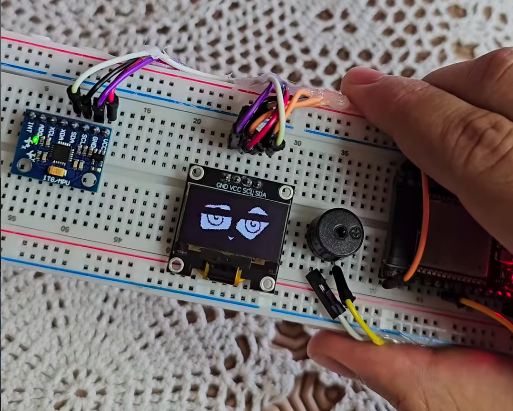

# Dizzy OLED Face

A tiny ESP32-powered animated OLED face that reacts when you shake it. The face normally blinks on a 128x64 SSD1306 OLED display, detects motion with an MPU6050 accelerometer, switches into a dizzy animation when shaken, and plays simple buzzer sounds for the dizzy and recovery states.



[Watch the demo on Instagram](https://www.instagram.com/p/DXwn1kIs94s/)

## Features

- 128x64 monochrome OLED face animation
- Normal blinking face mode
- Shake detection using an MPU6050 accelerometer
- Dizzy face animation after shaking
- Passive buzzer melody while dizzy
- Return sound when the face goes back to normal
- PlatformIO project using the Arduino framework for ESP32

## Hardware

- ESP32 DOIT DevKit V1
- SSD1306 128x64 I2C OLED display
- MPU6050 accelerometer/gyroscope module
- Passive piezo buzzer
- Jumper wires
- Breadboard

## Wiring

The sketch uses the ESP32 default I2C pins because `Wire.begin()` is called without custom pins.

| Component | Module Pin | ESP32 Pin |
| --- | --- | --- |
| OLED | VCC | 3V3 |
| OLED | GND | GND |
| OLED | SDA | GPIO 21 |
| OLED | SCL | GPIO 22 |
| MPU6050 | VCC | 3V3 |
| MPU6050 | GND | GND |
| MPU6050 | SDA | GPIO 21 |
| MPU6050 | SCL | GPIO 22 |
| Buzzer | Signal / + | GPIO 32 |
| Buzzer | GND / - | GND |

Both the OLED and MPU6050 share the same I2C bus.

## I2C Addresses

- OLED SSD1306: `0x3C`
- MPU6050: default address, usually `0x68`

## Libraries

The required libraries are listed in `platformio.ini`:

```ini
lib_deps =
    adafruit/Adafruit SSD1306 @ ^2.5.9
    adafruit/Adafruit GFX Library @ ^1.11.9
    adafruit/Adafruit MPU6050 @ ^2.2.6
    adafruit/Adafruit Unified Sensor @ ^1.1.14
```

PlatformIO installs these automatically during build.

## Build And Upload

1. Open the project in VS Code with the PlatformIO extension installed.
2. Connect the ESP32 board by USB.
3. Build the project:

```bash
pio run
```

4. Upload to the ESP32:

```bash
pio run --target upload
```

5. Open the serial monitor if needed:

```bash
pio device monitor
```

The monitor speed is set to `115200`.

## How It Works

The project starts in normal blink mode and draws bitmap frames from `src/face_frames.h` on the OLED. The MPU6050 is sampled every 20 ms. When a strong motion change is detected, the sketch waits until the shake stops, then switches to dizzy mode.

Dizzy mode lasts about 2 seconds. During that time, the OLED plays the dizzy animation and the buzzer loops a short dizzy sound. When the animation finishes, the face returns to blink mode and plays a recovery sound.

## Project Structure

```text
dizzy-oled/
├── images/
│   └── demo.png
├── src/
│   ├── main.cpp
│   └── face_frames.h
├── platformio.ini
└── README.md
```

## Configuration

Important values in `src/main.cpp`:

```cpp
#define SCREEN_WIDTH 128
#define SCREEN_HEIGHT 64
#define OLED_ADDRESS 0x3C
#define BUZZER_PIN 32
```

Shake sensitivity and timing:

```cpp
const float SHAKE_DELTA_THRESHOLD = 4.0;
const uint32_t SHAKE_STOP_MS = 100;
const uint32_t DIZZY_DURATION_MS = 2000;
```

Lower `SHAKE_DELTA_THRESHOLD` if you want the face to become dizzy more easily. Increase it if the face triggers too often.
